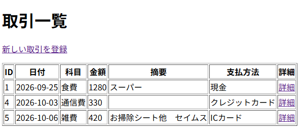
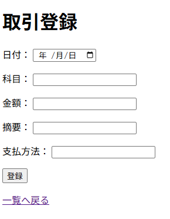
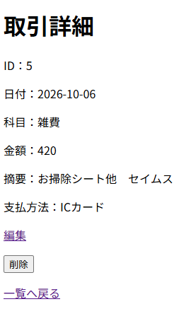
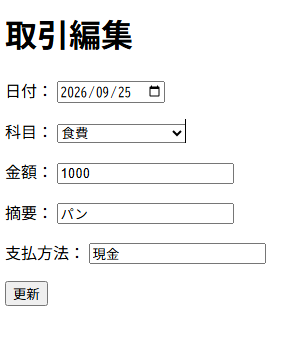
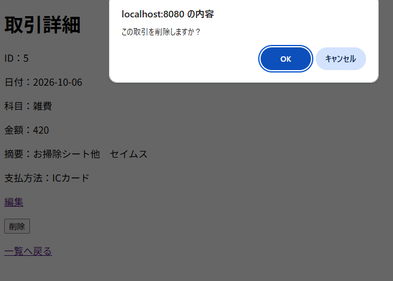
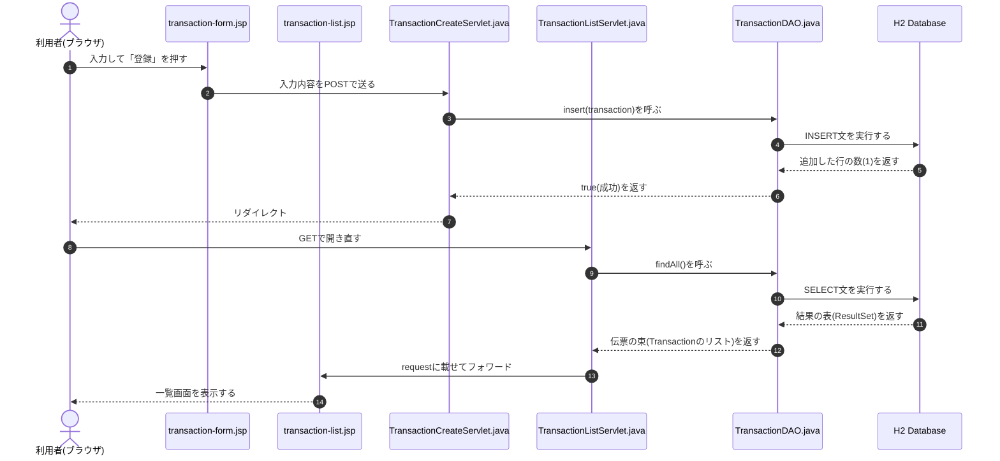
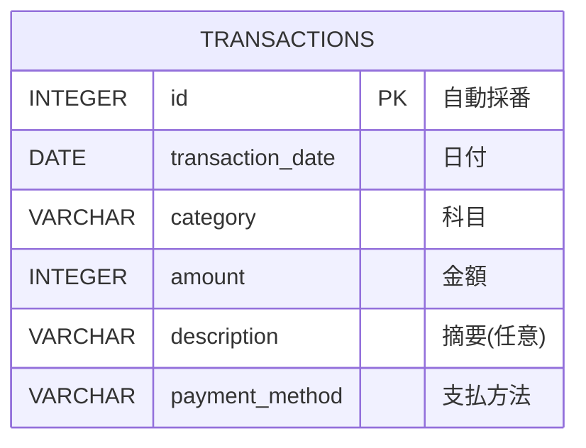

# HouseholdBudget（家計・予実管理アプリ）

## 概要
家計管理のための家計簿Webアプリです。

未経験からJavaのWeb開発を学習する中で、
MVC・DAO・JDBC・CRUDの理解を深めることを目的に制作しました。
経理経験を活かして、記録を予算管理や振り返りに用いたいと考えました。

## 主な機能
- 取引の一覧表示
- 取引の登録
- 取引の詳細表示
- 取引の編集
- 取引の削除

## 開発中・今後の予定
- 科目管理
- 予算管理
- 予算超過アラート

## 画面
### 一覧画面
登録した取引を一覧で表示します。「詳細」から各取引の詳細画面に移動できます。


### 登録画面
取引を登録します。


### 詳細画面
取引の詳細を表示します。「編集」で取引の編集画面に移動できます。「削除」で削除前の確認に進みます。


### 編集画面
取引内容の編集ができます。内容を変更してから「更新」を押すと変更が反映され、一覧画面に戻ります。


### 削除前の確認
OKを押すと削除できます。確認画面をはさむことで、間違って削除してしまうことを防ぎます。



## 使用技術
- Java
- Servlet / JSP
- JDBC
- JSTL
- H2 Database
- Apache Tomcat 11
- Eclipse

## 構成
- Model：Transaction→取引のID、日付、科目、金額、摘要、支払方法を保持します。
- View：JSP→一覧・登録・詳細・編集画面を担当します。
- Controller：Servlet→リクエストを受け取り、DAOの呼び出しや画面遷移を担当します。
- DAO：TransactionDAO→JDBCを利用してH2 DatabaseへのSELECT / INSERT / UPDATE / DELETEを担当します。

## 処理の流れ(登録 → 一覧表示)


## テーブル設計(ER図)


## 起動方法
### 必要な環境
- Java 25
- Apache Tomcat 11
- H2 Database 2.4.240
- Eclipse

### テーブルの作成

```sql
CREATE TABLE transactions (
	id INTEGER GENERATED BY DEFAULT AS IDENTITY PRIMARY KEY,
	transaction_date DATE NOT NULL,
	category VARCHAR(50) NOT NULL,
	amount INTEGER NOT NULL,
	description VARCHAR(255),
	payment_method VARCHAR(50) NOT NULL
);
```

### 起動手順
1. このリポジトリーをクローンし、Eclipseにインポートする
2. スタートメニューから「H2 Console」を起動する
3. タスクトレイのH2アイコンを右クリックし、「Create a new database...」で `~/householdbudget` を作る（ユーザー名 `sa`）
4. H2コンソールに接続し、上の「テーブルの作成」のSQLを実行する
   - JDBC URL：`jdbc:h2:tcp://localhost/~/householdbudget`
   - ユーザー名：`sa`、パスワード：なし
5. EclipseでプロジェクトをTomcat 11に追加して起動する
6. ブラウザで `http://localhost:8080/HouseholdBudget/TransactionListServlet` を開く

## 学習・工夫したこと

- 主な処理の説明や流れをコメントで残すことで、ただ入力するだけでなく、コードの理解を深められるようにした。
- MVCを意識してServletとJSPの役割を分けた
- DAOを使用してデータベース処理を分離した
- PreparedStatementを使用してSQLを実行した
- 取引のIDを利用して詳細表示・編集・削除を実装した

## 開発中に発生した問題と解決

### GitHubへのプッシュが拒否された

EclipseからGitHubへプッシュした際、「git-receive-pack not permitted」というエラーが出た。GitHubのアクセストークンの使えるリポジトリーが限定されていて、新しく作ったHouseholdBudgetが含まれていなかった。
エラーメッセージから原因を絞り込み、トークンの設定画面で、対象のリポジトリーにHouseholdBudgetを追加した。トークンは、使う範囲を限定して作ると安全であることも学んだ。

### コードの記載漏れやタイプミスにより画面が表示されなかった

${pageContext.request.contextPath}の`contextPath`の`P`が小文字のままだったり、入力間違いが起こってしまった。エラーメッセージから間違いの行を確認して訂正したり、AIにスクリーンショットを送って問題解決にあたった。
タイプミスに気を配る、エラーメッセージを読み解く大事さを学んだ。

### JSPで // のコメントを使い、画面に文字が表示されてしまった

Javaのコメントの使い方と間違ってしまった。<%-- --%> に修正した。

### 漢字の多い画面を、Chromeが中国語と判定して自動翻訳してしまった

日本語と認識されるように、<html lang="ja"> を指定した。

## AIの活用

開発ではChatGPT、Claudeを学習支援・デバッグ支援として利用しました。

完成コードをそのまま利用するのではなく、
処理を小さな単位に分けて、
コードの役割を確認しながら実装しました。

エラーが発生した際には、
原因を確認して修正する流れも学習しました。